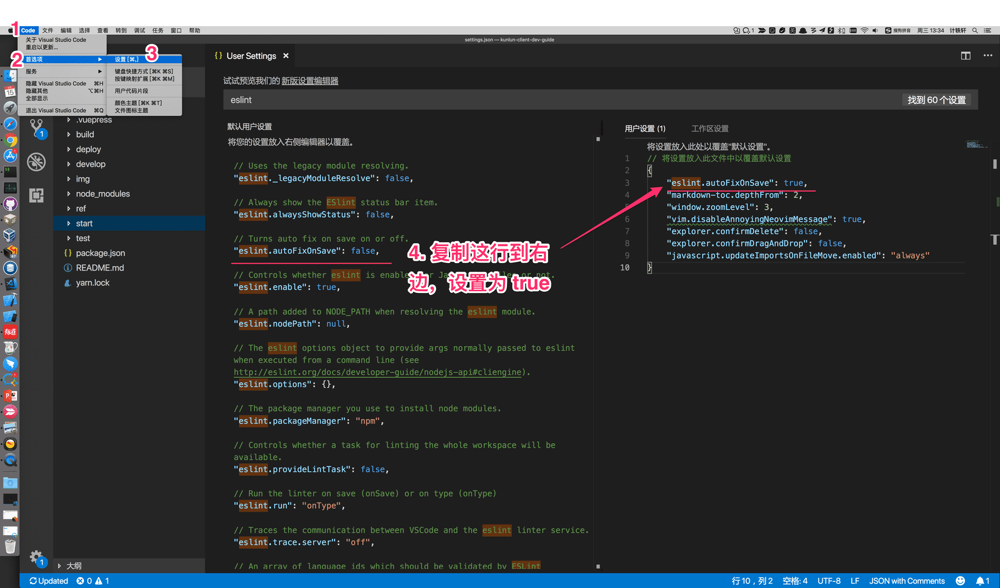

# 开发环境

## 1. Node.js
终端执行 `node -v` 如果能打印出版本号说明已经安装，没有安装的到[官网](https://nodejs.org)下载安装最新稳定版。此外，我还建议安装 Node 版本管理器 [nvm](https://github.com/creationix/nvm)。

## 2. Yarn
用来替代 npm，介绍和安装方法见[官网](https://yarnpkg.com/)

## 3. Visual Studio Code

[官网](https://code.visualstudio.com)下载安装。

安装一些实用插件：
- ESLint 插件, repo: [https://github.com/Microsoft/vscode-eslint](https://github.com/Microsoft/vscode-eslint)。安装好后，设置 eslint.autoFixOnSave=true，这样的好处是每次文件保存时都为执行一次 eslint 自动修复，具体的修复规则取决于项目的 eslint 配置，例如开启 [no-var](https://eslint.org/docs/rules/no-var) 规则时，`var` 会被自动修改成 `let`。

- ...

## 4. Chrome 插件
- [Redux DevTools Extension](https://chrome.google.com/webstore/detail/redux-devtools/lmhkpmbekcpmknklioeibfkpmmfibljd?hl=zh-CN)
