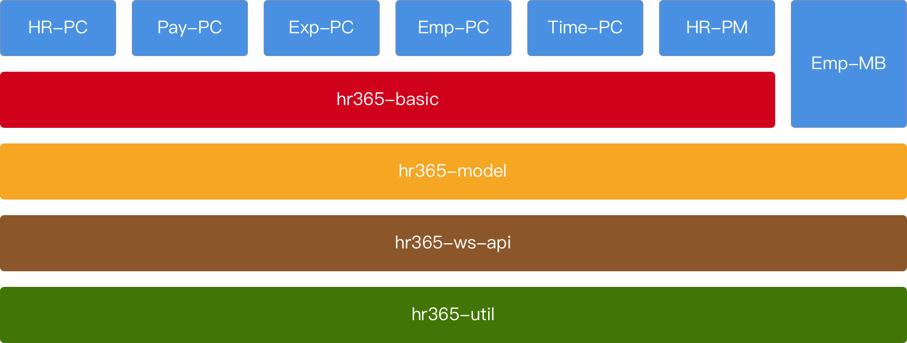

# 应用架构

## 1. 技术栈
- 桌面端（浏览器或 Electron 环境）
    - UI
        - [React](https://reactjs.org)
        - 组件库 [Ant Design](https://ant.design/index-cn)
        - 路由方案 [react-router](https://github.com/ReactTraining/react-router)
    - 数据流 
        - [DvaJS](https://dvajs.com)，封装了 [redux](https://github.com/reduxjs/redux)、[redux-saga](https://github.com/redux-saga/redux-saga) 和 [react-router](https://github.com/ReactTraining/react-router)
    - 网络 
        - [isomorphic-fetch](https://github.com/matthew-andrews/isomorphic-fetch)，浏览器环境调用的其实是 [GitHub's WHATWG Fetch polyfill](https://github.com/github/fetch)
        - [Strophe.js](http://strophe.im/strophejs/)，基于 WebSocket 实现的 XMPP 库
    - 构建
        - [Node.js](https://nodejs.org)，现代前端构建系统的核心
        - [Babel](https://babeljs.io)，js 编译器，将 ES6+ 转译为 ES5
        - [ESLint](https://eslint.org)，用于静态语法检查
        - [webpack](https://webpack.js.org)，打包器，通过构建 [dependency graph](https://webpack.js.org/concepts/dependency-graph/) 将所有 js 源码打包成一个 bundle 文件
        - [roadhog](https://github.com/sorrycc/roadhog)，可配置 [create-react-app](https://github.com/facebook/create-react-app)，内部基于 [af-webpack](https://github.com/umijs/umi/tree/master/packages/af-webpack)。（注：roadhog 官方已经[不再维护](https://github.com/sorrycc/roadhog/issues/855)，未来我们将迁移至 [UmiJS](https://github.com/umijs/umi)）
        - [svgr](https://github.com/smooth-code/svgr)，Transform SVGs into React components
        - [Electron](https://electronjs.org)，用于构建桌面应用。集成了 [Chromium](https://www.chromium.org/Home) 和 [Node.js](https://nodejs.org)，可以简单理解成一种可定制的浏览器，同时允许你调用一些操作系统级的 api，比如 [系统托盘](https://electronjs.org/docs/api/tray)
- 移动端（iOS 或 Android 环境）
    - UI
        - [React Native](http://facebook.github.io/react-native/)
        - 组件库 [Ant Design Mobile RN](https://rn.mobile.ant.design)
        - 导航方案 [React Navigation](https://reactnavigation.org)
        - svg 渲染方案 [react-native-svg](https://github.com/react-native-community/react-native-svg)
    - 数据流 
        - 与桌面端一样采用 [DvaJS](https://dvajs.com)
    - 网络
        - React Native 内置 [fetch](http://facebook.github.io/react-native/docs/network#using-fetch)
    - 构建
        - 与桌面端一样，依然需要 [Node.js](https://nodejs.org)、[Babel](https://babeljs.io)、[ESLint](https://eslint.org)
        - [Metro](https://github.com/facebook/metro)，The JavaScript bundler for React Native

## 2. HR365 前端工程结构

### 2.1. hr365-util
工具库

[https://192.168.1.118:1443/svn/hr365/HRCODE/Basic/Client/hr365-util](https://192.168.1.118:1443/svn/hr365/HRCODE/Basic/Client/hr365-util)

### 2.2. hr365-ws-api
网络接口

[https://192.168.1.118:1443/svn/hr365/HRCODE/Basic/Client/hr365-ws-api](https://192.168.1.118:1443/svn/hr365/HRCODE/Basic/Client/hr365-ws-api)

### 2.3. hr365-model
每个业务都是一个独立的 npm 包，可以单独发布：

#### 2.3.1. hr365-basic-model
通用业务

[https://192.168.1.118:1443/svn/hr365/HRCODE/Basic/Client/hr365-model/branches/dev/packages/hr365-basic-model](https://192.168.1.118:1443/svn/hr365/HRCODE/Basic/Client/hr365-model/branches/dev/packages/hr365-basic-model)

#### 2.3.2. hr365-hr-model 
人员管理业务

[https://192.168.1.118:1443/svn/hr365/HRCODE/Basic/Client/hr365-model/branches/dev/packages/hr365-hr-model](https://192.168.1.118:1443/svn/hr365/HRCODE/Basic/Client/hr365-model/branches/dev/packages/hr365-hr-model)

#### 2.3.3. hr365-pay-model 
薪酬管理业务

[https://192.168.1.118:1443/svn/hr365/HRCODE/Basic/Client/hr365-model/branches/dev/packages/hr365-pay-model](https://192.168.1.118:1443/svn/hr365/HRCODE/Basic/Client/hr365-model/branches/dev/packages/hr365-pay-model)

#### 2.3.4. hr365-exp-model 
费用管理业务

[https://192.168.1.118:1443/svn/hr365/HRCODE/Basic/Client/hr365-model/branches/dev/packages/hr365-exp-model](https://192.168.1.118:1443/svn/hr365/HRCODE/Basic/Client/hr365-model/branches/dev/packages/hr365-exp-model)

#### 2.3.5. hr365-time-model 
时间管理业务

[https://192.168.1.118:1443/svn/hr365/HRCODE/Basic/Client/hr365-model/branches/dev/packages/hr365-time-model](https://192.168.1.118:1443/svn/hr365/HRCODE/Basic/Client/hr365-model/branches/dev/packages/hr365-time-model)

### 2.4. hr365-basic
桌面版基础控件

### 2.5. HR-PC
人力资源管理桌面版

[https://192.168.1.118:1443/svn/hr365/HRCODE/HR/Client/HR-PC](https://192.168.1.118:1443/svn/hr365/HRCODE/HR/Client/HR-PC)

### 2.6. Pay-PC
薪酬管理桌面版

[https://192.168.1.118:1443/svn/hr365/HRCODE/Payroll/Client/Pay-PC](https://192.168.1.118:1443/svn/hr365/HRCODE/Payroll/Client/Pay-PC)

### 2.7. Exp-PC
费用管理桌面版

[https://192.168.1.118:1443/svn/hr365/HRCODE/Exp/Client/Exp-PC](https://192.168.1.118:1443/svn/hr365/HRCODE/Exp/Client/Exp-PC)

### 2.8. Time-PC
时间管理桌面版

[https://192.168.1.118:1443/svn/hr365/HRCODE/Time/Client/Time-PC](https://192.168.1.118:1443/svn/hr365/HRCODE/Time/Client/Time-PC)

### 2.9. Emp-PC
员工自助桌面版

[https://192.168.1.118:1443/svn/hr365/HRCODE/Emp/Client/Emp-PC](https://192.168.1.118:1443/svn/hr365/HRCODE/Emp/Client/Emp-PC)

### 2.10. Emp-MB
员工自助手机版

[https://192.168.1.118:1443/svn/hr365/HRCODE/Emp/Client/Emp-MB](https://192.168.1.118:1443/svn/hr365/HRCODE/Emp/Client/Emp-MB)

### 2.11. HR-PM
平台管理

[https://192.168.1.118:1443/svn/hr365/HRCODE/PM/Client/HR-PM](https://192.168.1.118:1443/svn/hr365/HRCODE/PM/Client/HR-PM)
